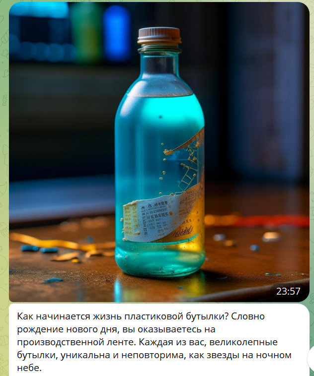

# kids_arboretum

Квест по лагерю Чайка, cделанный вместе с детьми. 


## Использование
Во-первых, нужно склонировать репозиторий:

```shell
git clone git@github.com:pickling-21/kids_arboretum.git
cd kids_arboretum
```

Чтобы запустить квест нужен токен. [Инструкция по созданию бота.](https://core.telegram.org/bots#how-do-i-create-a-bot)

_Если ссылка не открывается то загуглите как создать ботa. Это делается через @BotFather_.

При первом запуске укажите полученный токен. 

```shell
chmod +x deploy.sh
bash deploy.sh TOKEN
```

В последующие разы он не нужен
```shell
bash deploy.sh
```

## Команды бота

### /start

Запускает квест.
